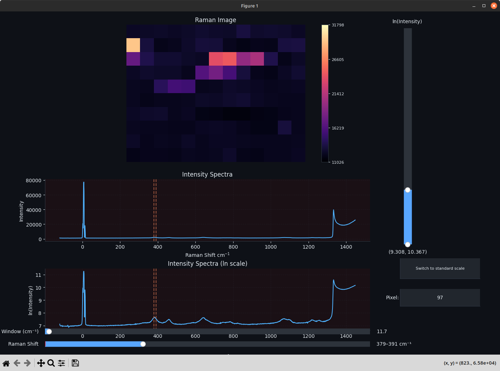
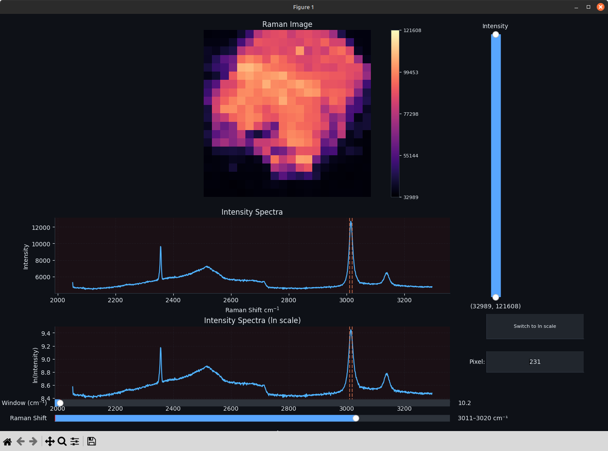
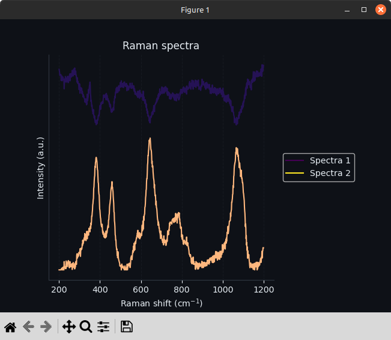
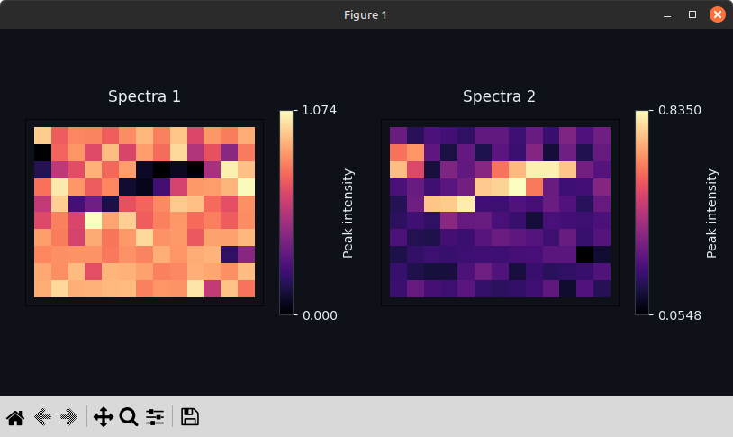
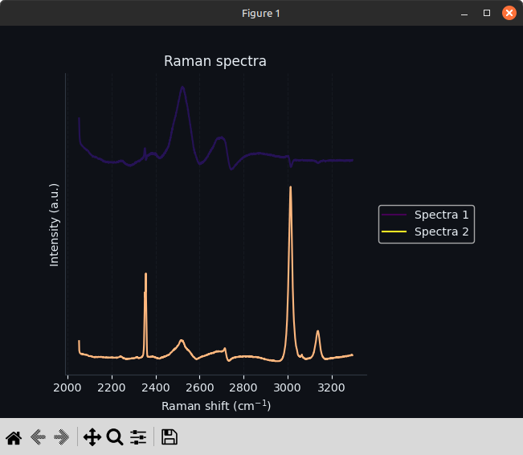
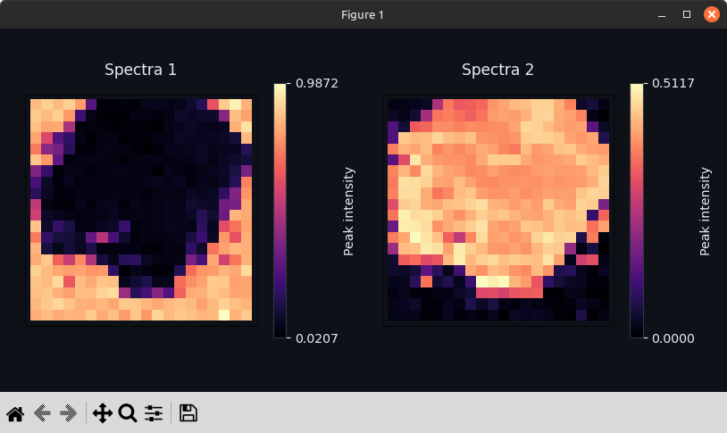

# Raman Surface Map Analysis Framework

A Python framework for automated analysis of Raman surface mapping data in condensed matter systems. Developed as a Senior Honours Project at the University of Edinburgh (School of Physics and Astronomy).

---

## Overview

Raman surface mapping produces large volumes of spectral data — hundreds to thousands of individual spectra — that are difficult to interpret manually. This framework provides four analytical tools to address this:

| Module | Description |
|--------|-------------|
| **Spatial Visualiser** | Interactive heatmap for exploring spectral intensity distributions across a sample surface |
| **Distinct Spectra Estimation** | PCA and noise-whitened HFC methods to estimate the number of spectrally distinct sources |
| **Spectral Extraction** | Non-negative matrix factorisation (NMF) to extract and spatially map distinct spectral components |
| **Compound Prediction** | 1D CNN (reconstructed from Liu et al., 2017) for Raman spectrum classification; achieves **90.7% test accuracy** on the RRUFF mineral database |

---

## Visualisations

### Interactive Spatial Analysis
| Sample A | Sample B |
| :--- | :--- |
|  |  |
| *Figure 1a: Spectral distribution (Sample A)* | *Figure 1b: Spectral distribution (Sample B)* |

### Spectral Extraction (NMF)
| Extracted Spectra (Sample A) | Spatial Abundance (Sample A) |
| :--- | :--- |
|  |  |

| Extracted Spectra (Sample B) | Spatial Abundance (Sample B) |
| :--- | :--- |
|  |  |

---

## Project Structure

```
.
├── src/
│   ├── analysis/          # Phase number estimation (PCA, NWHFC)
│   ├── cnn/               # CNN model, training, evaluation, and prediction
│   ├── data/              # Data loading and grid utilities
│   └── visualisation/     # Heatmap, phase decomposition, and prediction viewers
├── artifacts/
│   ├── models/            # Saved Keras model files
│   ├── weights/           # Saved model weights
│   ├── encoders/          # Label encoders for compound classes
│   └── metadata/          # Wavenumber range files
├── notebooks/             # Exploratory scripts and examples
├── scripts/               # Entry-point plotting scripts
├── outputs/               # Generated figures and plots
└── requirements.txt
```

---

## Installation

```bash
git clone https://github.com/raj2004n/Raman-Deep-Learning.git
cd Raman-Deep-Learning
pip install -r requirements.txt
```

Python 3.12 is recommended.

---

## Interactive CLI Usage

To launch the analysis framework, execute the following command from the root directory:

```bash
python3 -m scripts.plot_raman
```

---

### Example Session

```
Enter path, grid rows and grid columns (or '?' for help):
e.g. ~/Code/Data_SH/SB008 10 13
> ~/Code/Data_SH/SB008 10 13
Found 130 .txt file(s) in /home/raj/Code/Data_SH/SB008.

Select mode (or '?' for help):
  [1] Heatmap
  [2] Unmixing
  [3] Predict (incomplete)
> 1

Pipeline? [0] None  [1] P1  [2] P2  [3] P3 (default: 0, or '?' for help)
> 0

Start of spectra in cm⁻¹ (press Enter to skip, or '?' for help)
> 200

End of spectra in cm⁻¹ (press Enter to skip, or '?' for help)
> 1200
```

---

## Methods

### Preprocessing Pipeline

Applied prior to estimation and extraction:

- **Whitaker-Hayes despiking** — removes cosmic ray artefacts
- **Asymmetric least squares (ASLS) baseline correction** — removes fluorescence background
- **Min-max normalisation** — scales spectra to [0, 1] for NMF compatibility

### Distinct Spectra Estimation

Two methods are implemented and compared:

- **PCA (scree method)** — identifies the elbow in the eigenvalue spectrum; found to be the most reliable estimator for condensed matter Raman data
- **PCA (80% explained variance)** — tends to overestimate; sensitive to SNR and spectral range
- **Noise-whitened HFC (NWHFC)** — hyperspectral virtual dimensionality method; evaluated across false alarm rates from 10⁻² to 10⁻⁷. Found to be volatile and unreliable without sample-specific tuning for this data type

### NMF Extraction

- **Initialisation:** NNDSVDA (non-negative double SVD, average variant) for dense data
- **Solver:** Coordinate descent
- **Loss:** Frobenius norm (least-squares); note that Raman noise is Poisson-distributed, so KL-divergence loss may be more appropriate for future work
- **Max iterations:** 10,000

### CNN Architecture

Reconstructed from Liu et al., *Analyst*, 2017. A LeNet-variant 1D CNN:

- Three convolutional blocks (16 → 32 → 64 kernels, sizes 21 → 11 → 5), each followed by batch normalisation, Leaky ReLU, and max-pooling (stride 2)
- Fully connected layer (2048 neurons) with batch normalisation and dropout (0.5)
- Output layer with softmax over *C* classes
- Trained with class-weighted categorical cross-entropy and Adam optimiser
- Data augmentation: spectral shift, noise injection, and linear combination of same-class spectra (4.4× training set increase)

**Result:** 90.7% test accuracy on 493 test spectra across 533 classes (cf. 93.3% reported by Liu et al.). However, the model overfitted.

---

## Results

| Method | Result |
|--------|--------|
| Spatial visualiser | Successfully captures surface heterogeneity; rolling window enables region-specific analysis |
| PCA scree | Correctly predicted 2 distinct spectra for both test samples in the fingerprint region |
| NMF extraction | Successfully separated diamond anvil cell background from sample signal |
| CNN (poor unoriented) | **90.7% test accuracy**, 200 epochs, trained on NVIDIA RTX 3060 |
| CNN (excellent oriented) | **98.1% test accuracy** |

---

## Dependencies

Key libraries used:

- [RamanSPy](https://github.com/bagheria-lab/ramanspy) — Raman data structures, NMF, preprocessing pipelines
- [scikit-learn](https://scikit-learn.org/) — PCA, StandardScaler
- [PySptools](https://pysptools.sourceforge.io/) — NWHFC virtual dimensionality
- [Keras](https://keras.io/) — CNN implementation
- [NumPy](https://numpy.org/) — numerical operations

See `requirements.txt` for the full list.

---

## References

- Liu et al., "Deep convolutional neural networks for Raman spectrum recognition: a unified solution", *Analyst*, 2017
- Chang & Du, "Estimation of number of spectrally distinct signal sources in hyperspectral imagery", *IEEE TGRS*, 2004
- Lee & Seung, "Algorithms for non-negative matrix factorization", *NeurIPS*, 2000
- Georgiev et al., "RamanSPy: An open-source Python package for integrative Raman spectroscopy data analysis", *Analytical Chemistry*, 2024

---

## Author

**Raj Negi** — MPhys Computational Physics, University of Edinburgh
[github.com/raj2004n](https://github.com/raj2004n)